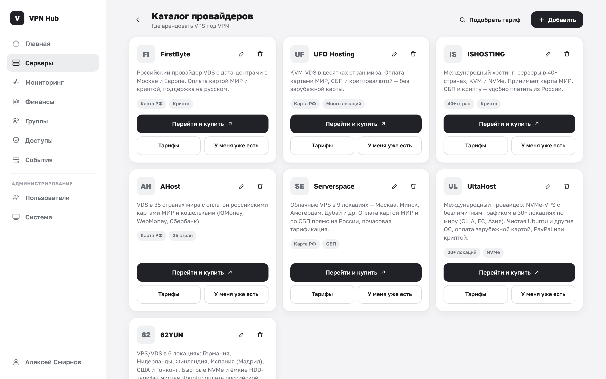

# Каталог провайдеров

Каталог провайдеров — это подборка мест, где арендовать VPS под VPN. Он помогает владельцам быстро
найти провайдера и добавить сервер. Каталог открывается из раздела **Серверы → «Каталог»**.

## Что видят владельцы

Каждый провайдер показан карточкой: название, описание, теги и две кнопки:

- **«Перейти и купить»** — открывает сайт провайдера.
- **«У меня уже есть»** — открывает форму [добавления сервера](../owner/servers.md#add)
  с уже выбранным провайдером.

Просматривать каталог могут все, а редактировать — только администратор.

## Управление каталогом (администратор)

Администратору доступны кнопки добавления, редактирования и удаления.

### Добавить или изменить провайдера

Кнопка **«Добавить»** (или карандаш у карточки) открывает форму:

| Поле | Описание |
|---|---|
| **Название** | Имя провайдера |
| **Ссылка для покупки** | URL страницы, куда ведёт кнопка «Перейти и купить» |
| **Описание** | Короткий текст на карточке |
| **Теги** | Через запятую, например: `Дёшево, Европа` |

Нажмите **«Сохранить»**.

### Удалить провайдера

Кнопка с корзиной удаляет провайдера. Подтвердите:

> Провайдер исчезнет из каталога. На уже созданные серверы это не влияет.

!!! note "Каталог — это подсказка, а не привязка"
    Каталог только помогает выбрать провайдера и заполнить форму. Уже добавленные серверы с
    провайдером каталога не связаны, поэтому изменение или удаление записи каталога на них не влияет.
    Добавить сервер можно и с провайдером «Другой», которого в каталоге нет.
