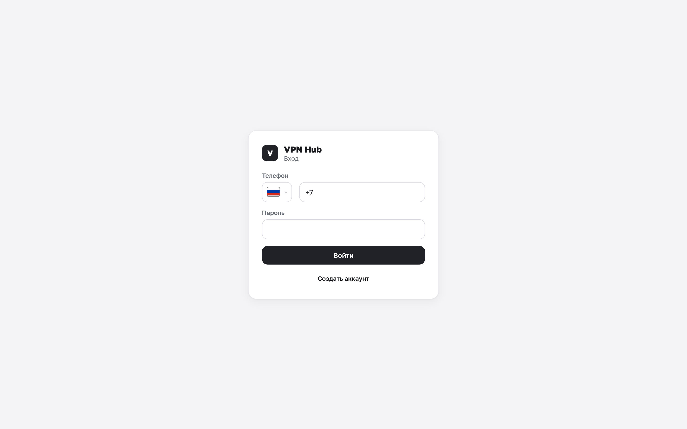

# Первый запуск и вход

Здесь описан первый вход в уже работающую панель. Если панель ещё не поднята — начните с
раздела [Установка](../deploy/index.md).

## Первичная настройка

Когда панель открывается на **пустой базе** и администратор не задан через переменные окружения,
вместо экрана входа показывается **Первичная настройка**. Здесь есть два пути:

- **Новая установка** — создать администратора с нуля;
- **Из бэкапа** — развернуть систему из ранее сделанной резервной копии.

### Новая установка

Заполните форму администратора:

- **Имя** — как вас будут видеть в панели.
- **Телефон** — он же логин для входа.
- **Пароль** — минимум 8 символов, и повтор для проверки.
- **Мастер-ключ восстановления** — минимум 8 символов (только если он не задан через окружение,
  см. ниже).

Если поле мастер-ключа показано, обязательно **скачайте ключ кнопкой «Скачать ключ (.txt)»** и
поставьте галочку «Я сохранил ключ восстановления в надёжном месте» — без неё кнопка создания
администратора останется недоступной. После этого нажмите **«Создать администратора»**: вы сразу
войдёте и попадёте в раздел **Система**.

!!! danger "Мастер-ключ нельзя восстановить"
    Мастер-ключом шифруются SSH-доступы к серверам и резервные копии. Если его потерять, вы не
    сможете ни расшифровать секреты серверов (например, при переносе на другой хост), ни
    восстановиться из бэкапа. Обратно в интерфейсе панель ключ **не показывает**, а при потере
    инстанса взять его неоткуда. Храните копию отдельно от сервера. Подробнее —
    [Мастер-ключ](../admin/backups.md#master-key).

### Из бэкапа {#restore}

Если вы переносите инстанс или восстанавливаете его после сбоя:

1. Переключитесь на вкладку **«Из бэкапа»**.
2. Выберите файл резервной копии (`.vhb`).
3. Введите **ключ шифрования** — тот самый мастер-ключ, которым бэкап был сделан.
4. Нажмите **«Восстановить систему»**.

После восстановления войдите под учётной записью из восстановленного бэкапа. Подробнее про формат
и создание копий — [Резервные копии](../admin/backups.md).

## Мастер-ключ через переменную окружения

Если при установке панели задана переменная `VPNHUB_MASTER_KEY`, поле мастер-ключа в форме не
показывается — панель сообщит, что ключ уже задан. В этом случае вводить и скачивать его на экране
настройки не нужно: ключ берётся из окружения. Управление ключом позже — в разделе
[Резервные копии и мастер-ключ](../admin/backups.md#master-key).

## Вход

На экране входа укажите **телефон** и **пароль**. После входа:

- владелец попадает в **Серверы**,
- участник — в **Доступно**.

!!! note "Слишком много попыток"
    Вход защищён от перебора: после серии неудачных попыток панель временно попросит подождать.
    Просто повторите чуть позже.

## Регистрация нового аккаунта

Если панель разрешает самостоятельную регистрацию, на экране входа есть **«Создать аккаунт»**.
Укажите имя, телефон и пароль (минимум 8 символов).

Что происходит дальше, зависит от того, ждёт ли вас приглашение:

- **Вас пригласили в группу** (вы регистрируетесь по инвайт-ссылке) — можно сразу войти, доступ
  участника появится автоматически.
- **Приглашения нет** — аккаунт создаётся в статусе «В ожидании», и войти получится только после
  того, как его подтвердит [администратор](../admin/users.md).

!!! tip "Самый простой путь для участника"
    Обычно участнику не нужно регистрироваться заранее — достаточно открыть присланную
    [ссылку-приглашение](../member/join.md): регистрация и вход произойдут прямо на экране
    присоединения к группе.

## Смена пароля и выход

Пароль, активные сессии и выход из аккаунта — в разделе
[Профиль и безопасность](../help/profile.md).
