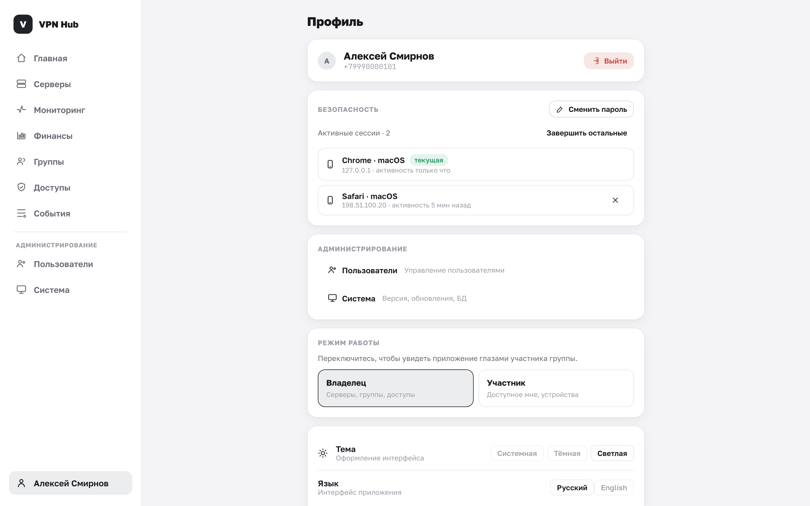

# Профиль и безопасность

Раздел **Профиль** есть у всех и открывается по имени внизу меню. Здесь — ваши данные, пароль,
сессии, тема оформления и (для владельца) переключение режима.

## Аккаунт

Вверху показаны ваше имя и телефон и кнопка **«Выйти»** — завершает текущую сессию и возвращает на
экран входа.

## Безопасность

### Смена пароля

Кнопка **«Сменить пароль»**: введите текущий пароль, новый (минимум 8 символов) и повтор.

!!! warning "Смена пароля завершает другие сессии"
    После смены пароля все остальные сессии, кроме текущей, автоматически завершаются. Это защищает
    аккаунт, если кто-то получил доступ к старому паролю.

### Активные сессии {#sessions}

Ниже — список ваших входов: устройство, IP и время активности. Текущая сессия помечена
**«текущая»**.

- Кнопка с крестиком у сессии — **завершить** конкретный вход.
- **«Завершить остальные»** — закрыть все сессии, кроме текущей.

Пользуйтесь этим, если заходили с чужого устройства или подозреваете, что доступ утёк.

## Администрирование

У администратора здесь появляются быстрые ссылки на разделы [Пользователи](../admin/users.md) и
[Система](../admin/system.md).

## Режим работы {#mode}

Владелец может переключаться между двумя режимами:

- **Владелец** — Серверы, Группы, Доступы.
- **Участник** — Доступно, Устройства.

Переключение в режим участника показывает панель так, как её видит приглашённый человек. Это удобно,
чтобы самому получить конфиг или проверить, что доступно вашей группе. Данные и права при этом не
меняются — меняется только набор разделов.

## Настройки

- **Тёмная тема** — переключатель светлой и тёмной темы. Выбор запоминается в браузере.
- **Язык** — интерфейс на русском языке.
