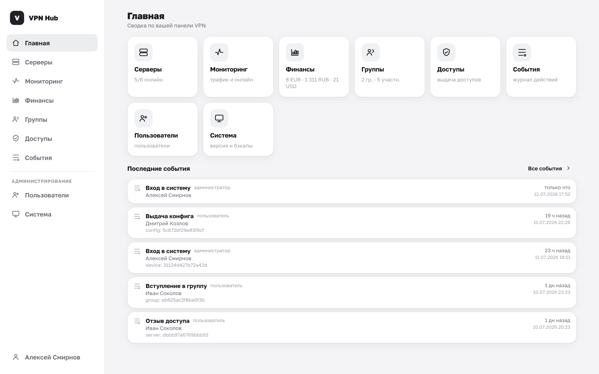

# VPN Hub



**VPN Hub** — это self-hosted панель, с помощью которой вы поднимаете собственную
VPN-инфраструктуру на арендованных серверах и раздаёте доступ близким: семье, друзьям,
коллегам. Один человек управляет серверами и доступами, остальные просто получают готовый
конфиг и подключаются.

Панель сама устанавливает VPN-софт на ваши серверы по SSH (Amnezia — с протоколами AmneziaWG и
Xray, OpenVPN, Outline), выдаёт и отзывает конфиги, следит за состоянием серверов и шифрует все
секреты.

!!! tip "Не путать с обычным VPN-приложением"
    VPN Hub — это **пульт управления**, а не сам VPN-клиент. Через него вы настраиваете серверы
    и выдаёте доступы, а подключаются участники в привычных приложениях (AmneziaVPN, OpenVPN
    Connect, Outline) по конфигу или QR-коду, который выдаёт панель.

## Три шага до работающего VPN

1. **[Установите панель](deploy/index.md)** — одна команда на машине с Docker:

    ```sh
    curl -fsSL https://raw.githubusercontent.com/AlexeyShalaev/vpn-hub/master/deploy/scripts/install.sh | bash
    ```

    На VPS с доменом добавьте `--domain vpn.example.com` (`… | bash -s -- --domain …`) —
    HTTPS настроится сам. Другие способы (Docker Compose, Kubernetes, `docker run`) — в
    разделе [**Установка**](deploy/index.md).

2. **[Войдите](guide/first-run.md)** — откройте `http://localhost:8000`, создайте администратора
   и сохраните мастер-ключ.

3. **[Быстрый старт](guide/quickstart.md)** — добавьте сервер, установите на него VPN и
   пригласите близких. Через несколько минут у них работает VPN.

## Кому что читать

В VPN Hub у человека может быть одна из трёх ролей — начните с раздела для своей.

| Роль | Кто это | С чего начать |
|---|---|---|
| **Владелец** | У вас есть серверы, вы раздаёте доступ | [Быстрый старт](guide/quickstart.md) |
| **Участник** | Вам открыли доступ, нужно подключиться | [Присоединение к группе](member/join.md) |
| **Администратор** | Вы отвечаете за сам инстанс панели | [Администрирование](admin/users.md) |

Роли не жёсткие: один и тот же человек может быть и владельцем, и администратором, а владелец
может посмотреть на панель [глазами участника](help/profile.md#mode). Как всё устроено — роли,
понятия, общая схема — в разделе [Как устроен VPN Hub](guide/overview.md).

## Что умеет VPN Hub

- **Серверы.** Добавление VPS вручную, из каталога провайдеров или автозаполнением из письма
  провайдера; проверка доступности и синхронизация состояния.
- **VPN на выбор.** Amnezia (максимальная устойчивость к блокировкам), OpenVPN (совместимость),
  Outline (простота). Установка идёт в фоне по SSH.
- **Группы и приглашения.** Группы близких, вход по ссылке или QR-коду, роли участников.
- **Гибкие доступы.** Пулы серверов и точечная выдача — вплоть до конкретных протоколов на
  конкретном сервере для конкретной группы.
- **Конфиги и устройства.** Участник добавляет устройства и получает конфиги в один-два клика:
  QR-код, файл или ссылка для приложения-клиента.
- **Безопасность.** Все SSH-доступы и бэкапы шифруются мастер-ключом; сессии, смена паролей,
  подтверждение регистраций администратором.
- **Обслуживание.** Резервные копии базы (ручные и по расписанию), обновления образа,
  контроль состояния.

## Куда идти за деталями

- [**Установка**](deploy/index.md) — все способы поднять панель, HTTPS, внешняя БД, обновления,
  переменные окружения.
- [**Начало работы**](guide/first-run.md) — первый вход, быстрый старт владельца, как всё устроено.
- [**Владельцу**](owner/servers.md) — серверы, VPN, группы, доступы.
- [**Участнику**](member/join.md) — присоединиться, добавить устройство, получить конфиг.
- [**Администрирование**](admin/users.md) — пользователи, система, бэкапы.
- [**Справка**](help/faq.md) — вопросы, решение проблем, глоссарий.
