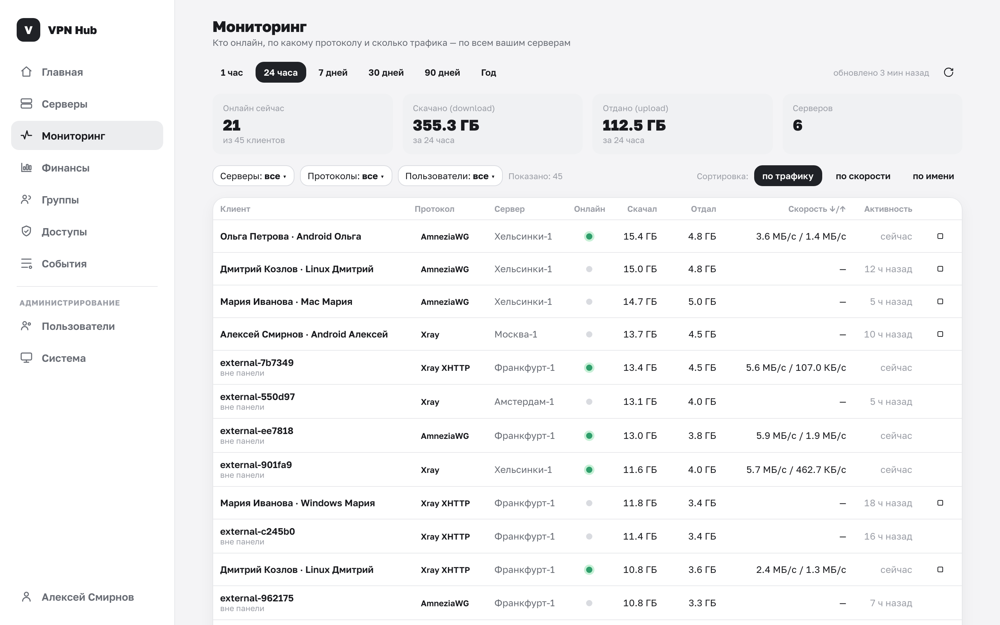
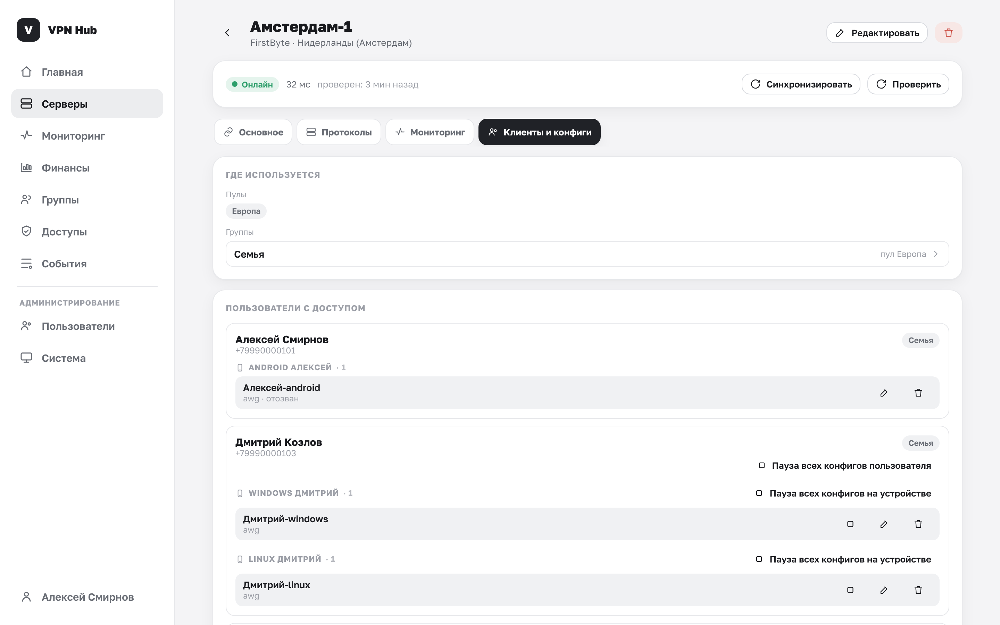

# Кто пользуется сервером

На странице каждого сервера, ниже блока с VPN, есть два раздела, которые показывают, где сервер
задействован и кто им реально пользуется.

## Где используется

Показывает, через что сервер выдан:

- **Пулы** — в какие пулы он входит.
- **Группы** — каким группам открыт, и **как именно** (напрямую или через пул). Нажатие на группу
  открывает её страницу.

Если сервер ещё не в пулах и не выдан ни одной группе — так и будет написано.

## Пользователи с доступом

Список людей, которым этот сервер доступен. Для каждого показаны:

- имя и телефон;
- через какие **группы** он получил доступ;
- пометка **«нет доступа»**, если формально человек к серверу привязан, но эффективного доступа
  сейчас нет (например, на сервере не осталось разрешённых ему VPN);
- **выданные конфиги** — на какое устройство и по какому протоколу, со статусом.

### Переименовать конфиг

Кнопка с карандашом у конфига позволяет задать понятное имя (например, «iPhone Ани») — оно же
используется как имя клиента на сервере.

### Отозвать конфиг

Кнопка с корзиной у конфига отзывает его. Подтвердите:

> Конфиг «…» перестанет работать: пир будет удалён на сервере, у пользователя доступ к этому серверу
> через него пропадёт.

Отзыв удаляет клиента (пир) на самом сервере — доступ через этот конфиг прекращается немедленно.
То же действие доступно в окне [«… · подробно»](vpn.md#peers).

## Отозвать конфиг или сузить доступ — что выбрать

Это разные по смыслу операции:

| Действие | Что делает | Когда применять |
|---|---|---|
| **Отзыв конфига** | Убирает один конкретный конфиг на сервере | Скомпрометировано одно устройство; нужно перевыпустить доступ |
| **Сужение доступа** ([Доступы](access.md)) | Закрывает серверу/VPN доступ для всей группы — конфиги отзываются автоматически | Группа или человек больше не должны пользоваться сервером |

!!! note "Отозвал — а конфиг вернулся?"
    Если у человека **всё ещё есть доступ** к серверу (через группу), он может просто получить
    конфиг заново в разделе «Доступно». Чтобы доступ пропал насовсем — уберите сервер или VPN из
    доступов группы либо исключите человека из группы. Тогда панель сама снимет конфиги и не даст
    выпустить новые.
