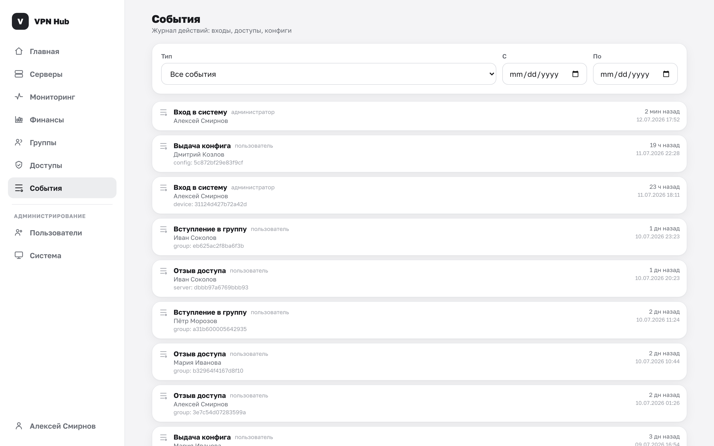

# События

Раздел **События** — журнал действий в панели: входы, выдача и отзыв доступов, скачивание конфигов,
вступления в группы. Помогает понять, кто и что делал.

## Что показывает

- **Событие** с читаемой подписью (вход в систему, выдача конфига, вступление в группу, отзыв
  доступа и др.), **актор** (кто это сделал), **время** и затронутый объект.
- **Фильтры** по типу события и диапазону дат.

Владелец видит события по своим ресурсам, администратор — по всему инстансу. Срок хранения журнала
настраивается переменной `VPNHUB_AUDIT_RETENTION_DAYS` (по умолчанию 90 дней) — см.
[переменные окружения](../deploy/configuration.md).
