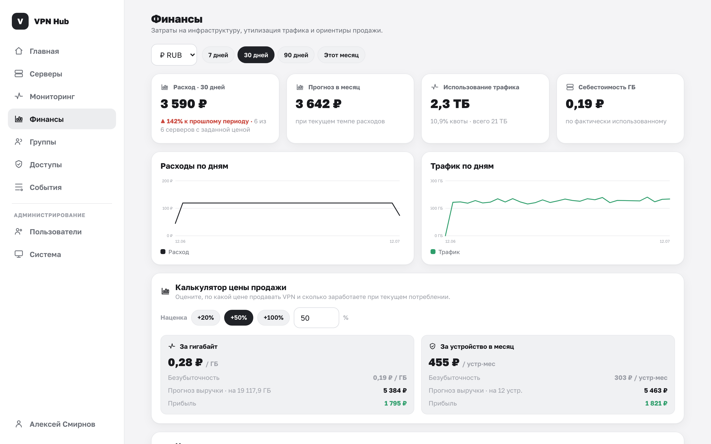

# Финансы

Раздел **Финансы** показывает, во сколько обходится ваша инфраструктура и сколько трафика она
потребляет, — чтобы понимать себестоимость и, если вы перепродаёте доступ, назначать цену.

## Что показывает

- **Расходы** за период (7 / 30 / 90 дней или календарный месяц) — суммируются цены серверов по
  сегментам истории, с трендом по дням. Валюты не смешиваются: приводятся к выбранной по курсам ЦБ РФ.
- **Утилизация трафика** — сколько израсходовано против квот тарифов, по всем серверам.
- **Себестоимость гигабайта** — по фактически использованному трафику.
- **Калькулятор цены продажи** — прикидка цены за ГБ или за устройство в месяц с выбранной наценкой
  и прогноз выручки и прибыли при текущем потреблении.

Цена сервера задаётся на его [странице](servers.md) в блоке «Стоимость» (сумма, валюта, период,
день оплаты). Историю цены панель хранит по сегментам, поэтому расход считается корректно даже после
смены тарифа.
