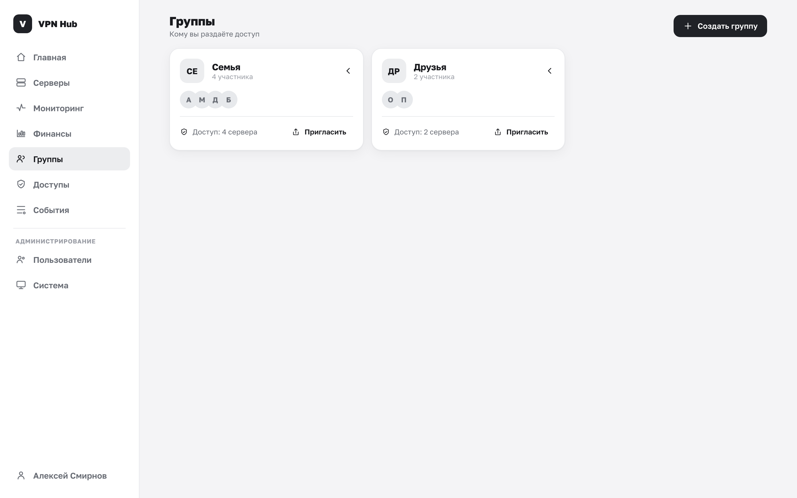
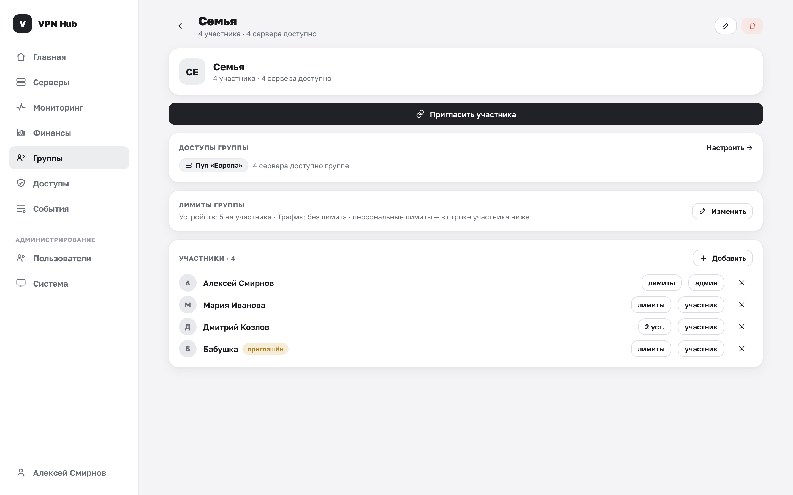

# Группы и участники

Группа — это набор людей, которым вы раздаёте доступ (например, «Семья» или «Друзья»). Доступ к
серверам выдаётся именно группам, а не отдельным людям, — так удобнее управлять.

## Список групп

В разделе **Группы** каждая группа показана карточкой: название, число участников, аватары и сводка
доступа («N серверов» или «без доступов»).

## Создание группы

1. Нажмите **«Создать группу»**.
2. Введите название и сохраните.

Вы автоматически становитесь участником своей группы с пометкой «(вы)». Дальше на странице группы
можно приглашать людей и настраивать доступы.

## Приглашения {#invite}

Самый простой способ добавить человека — пригласить его по ссылке или QR-коду.

1. На странице группы нажмите **«Пригласить участника»**.
2. Покажите **QR-код** (человек наводит камеру) или отправьте **ссылку** (кнопка «Копировать»).
3. Человек открывает ссылку, при необходимости регистрируется прямо там и присоединяется.

Ссылка-приглашение работает и до, и после входа: если аккаунта ещё нет, человек создаст его на том
же экране. Что видит приглашённый — [Присоединение к группе](../member/join.md).

!!! tip "Отозвать старую ссылку"
    Кнопка **«Новая ссылка»** в окне приглашения генерирует новый код. Старая ссылка сразу
    перестаёт работать — удобно, если прежняя куда-то утекла.

## Добавление участника вручную

Обычно люди присоединяются сами по ссылке, но участника можно завести и вручную — кнопка
**«Добавить»** в блоке «Участники»:

- **Имя** — как показывать участника (например, «Бабушка»).
- **Роль** — «Участник» или «Админ группы».
- **Телефон** — необязательно.

Что произойдёт, зависит от телефона:

| Что указали | Результат |
|---|---|
| Телефон уже зарегистрированного пользователя | Сразу активный участник, доступ появляется немедленно |
| Телефон человека без аккаунта | Участник со статусом **«приглашён»** — привяжется, когда человек зарегистрируется или войдёт с этим телефоном |
| Без телефона | Запись-заглядка для наглядности состава группы |

## Роли участников

У участника в группе есть роль — **участник** или **админ группы**. Нажатие на кнопку роли в строке
участника переключает её. Создатель группы отмечен как «админ» и «(вы)».

!!! note "Кто управляет группой"
    Настройками группы (доступы, состав, приглашения, переименование, удаление) управляет её
    **владелец** — тот, кто её создал. Роль «админ группы» — это пометка внутри группы, она не
    передаёт управление панелью другому человеку.

## Удаление участника

Кнопка с крестиком в строке участника удаляет его из группы. Участник сразу теряет доступ ко всем
серверам этой группы, а выданные ему через неё конфиги **автоматически отзываются** на серверах.

## Переименование и удаление группы

- **Переименовать** — кнопка с карандашом вверху страницы группы.
- **Удалить** — кнопка с корзиной. Подтвердите:

    > Участники потеряют доступ. Действие необратимо.

При удалении группы все её участники теряют выданный через неё доступ, а связанные конфиги
отзываются на серверах.

Кому и что открыто через группу — настраивается в разделе [Пулы и доступы](access.md).
