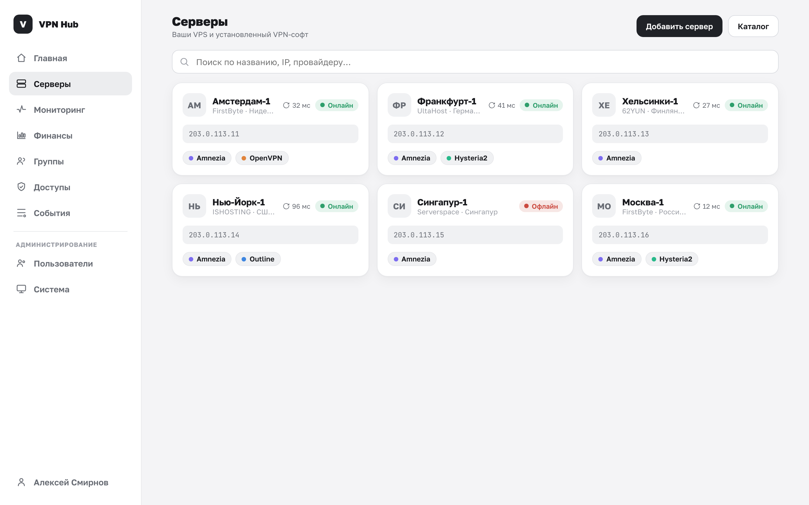
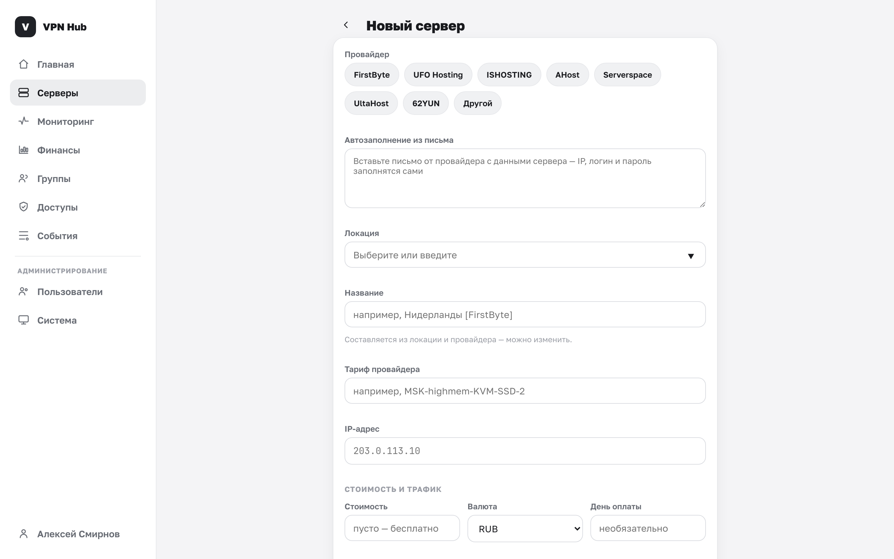
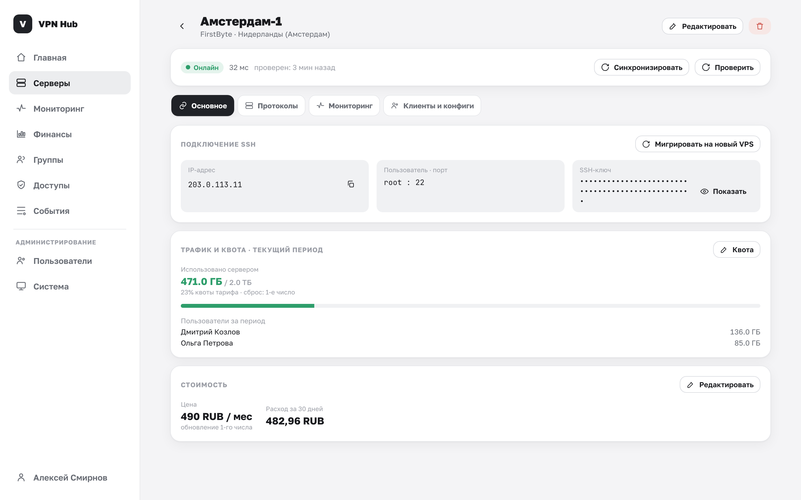
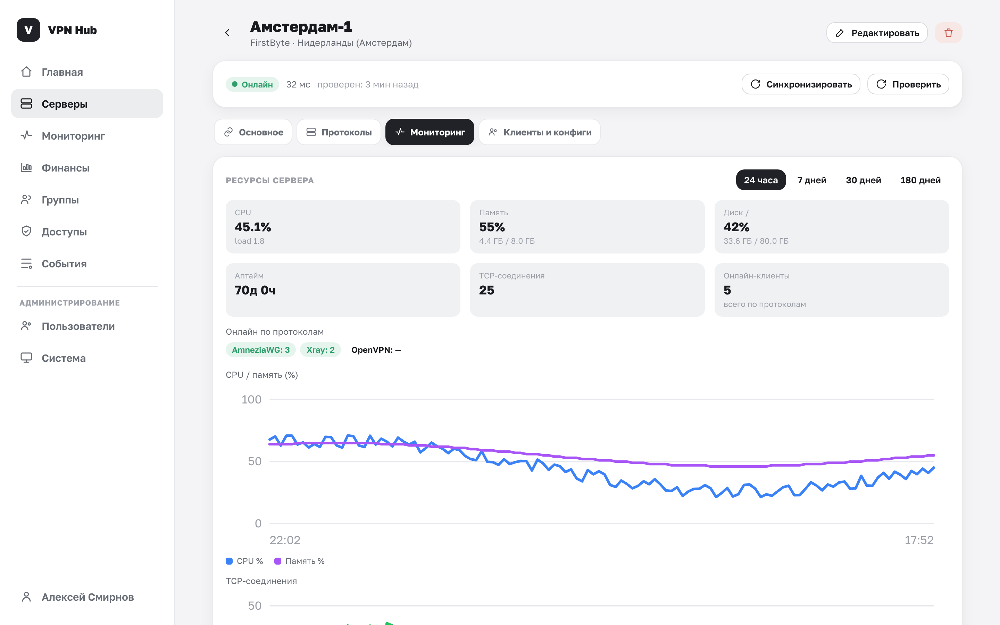

# Серверы

Сервер в VPN Hub — это ваш арендованный VPS. Панель хранит его адрес и SSH-доступ и по нему сама
ставит и обслуживает VPN. Раздел **Серверы** — стартовая страница владельца.

## Список серверов

Каждый сервер показан карточкой:

- название, провайдер и локация;
- IP-адрес;
- **статус** и задержка отклика;
- установленный VPN-софт (или «VPN ещё не установлен»).

Когда серверов становится три и больше, сверху появляется строка поиска по названию, IP,
провайдеру и локации.

### Статусы сервера {#status}

| Статус | Значит |
|---|---|
| **онлайн** | Сервер отвечает по SSH |
| **офлайн** | Сервер недоступен (нет ответа по SSH) |
| **не проверен** | Сразу после добавления, до первой проверки |

Статусы обновляются периодически в фоне, а также вручную — кнопками на странице сервера.

## Добавление сервера {#add}

Нажмите **«Добавить сервер»**. Есть три способа заполнить форму — можно сочетать.

### Способ 1. Из каталога провайдеров

Кнопка **«Каталог»** ведёт в [каталог провайдеров](../admin/catalog.md) — подборку, где арендовать
VPS. У карточки провайдера две кнопки: **«Перейти и купить»** (открывает сайт) и
**«У меня уже есть»** (открывает форму добавления с уже выбранным провайдером).

### Способ 2. Автозаполнение из письма

При создании сервера доступно поле **«Автозаполнение из письма»**. Вставьте туда письмо от
провайдера с данными сервера — панель распознает и подставит IP, логин, пароль, порт и локацию.
Распознанные данные подсветятся отметками; если распознать не удалось — заполните поля вручную.

### Способ 3. Вручную

Заполните поля формы:

| Поле | Описание |
|---|---|
| **Провайдер** | Выберите из списка или «Другой» и впишите своё название |
| **Название** | Понятное имя, например «Амстердам-1» |
| **IP-адрес** | Публичный адрес сервера (обязательно) |
| **Локация** | Например, «Нидерланды» — для удобства |
| **Способ авторизации** | «SSH-ключ» или «Пароль» |
| **SSH пользователь / Логин** | Обычно `root` |
| **Порт** | Обычно `22` |
| **SSH-ключ / Пароль** | Приватный ключ (путь или содержимое) либо пароль |

Обязательны **название** и **IP-адрес**. Нажмите **«Сохранить»** — панель откроет страницу сервера
и сразу проверит его доступность.

!!! warning "Нужен root или sudo"
    Панель устанавливает VPN в Docker-контейнерах и правит системные файлы, поэтому учётной записи
    нужны права `root` либо `sudo`. Для боевой эксплуатации предпочтителен доступ по SSH-ключу.

!!! info "Куда попадают SSH-доступы"
    Пароль или ключ сохраняются **в зашифрованном виде** — они шифруются
    [мастер-ключом](../admin/backups.md#master-key). Поэтому так важно задать надёжный мастер-ключ
    и хранить его копию.

## Страница сервера

Открыв сервер, вы увидите несколько блоков.

- **Статус** — текущее состояние, задержка и время последней проверки, плюс кнопки
  «Синхронизировать» и «Проверить».
- **Подключение SSH** — IP (можно скопировать), пользователь и порт, ключ или пароль (по кнопке
  «Показать»).
- **VPN ПО на сервере** — установка и управление VPN, см. [Установка VPN на сервер](vpn.md).
- **Где используется** и **Пользователи с доступом** — см. [Кто пользуется сервером](clients.md).

Вверху страницы — кнопки **«Изменить»** и удаления сервера.

### Проверить и Синхронизировать {#sync}

Это две разные операции:

- **Проверить** — быстрая проверка доступности: сервер онлайн или нет и какова задержка.
- **Синхронизировать** — полная сверка состояния: какие VPN-контейнеры реально стоят и запущены,
  какие конфиги ещё живы. Синхронизация подхватывает изменения, сделанные **в обход панели**
  (например, через официальный клиент Amnezia), и обновляет статусы. Она же выполняется
  периодически в фоне.

!!! note "Безопасность синхронизации"
    Если во время синхронизации сервер недоступен по SSH, панель **пропускает его целиком** и
    ничего не меняет — чтобы из-за временной недоступности не «отвалились» рабочие конфиги.

## Редактирование

Кнопка **«Изменить»** открывает ту же форму с текущими значениями. Здесь можно поменять адрес,
локацию, способ авторизации и SSH-доступ (например, после смены пароля на сервере). Автозаполнение
из письма при редактировании не показывается.

## Удаление

Кнопка с корзиной удаляет сервер. Подтвердите действие:

> Сервер пропадёт из пулов и групповых доступов. Действие необратимо.

Что происходит при удалении:

- сервер убирается из всех пулов и групповых доступов;
- участники теряют к нему доступ, а выданные конфиги перестают отслеживаться.

!!! tip "Удаление сервера в панели ≠ удаление VPS"
    Панель удаляет запись о сервере у себя. Сам VPS и установленные на нём контейнеры это не
    трогает — если VPS вам больше не нужен, откажитесь от него у провайдера отдельно.
