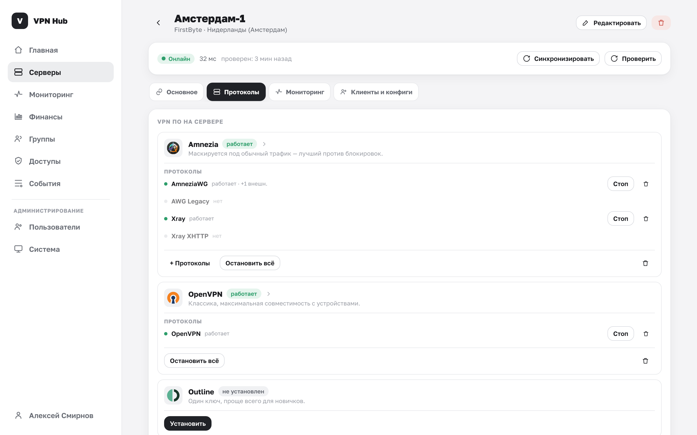
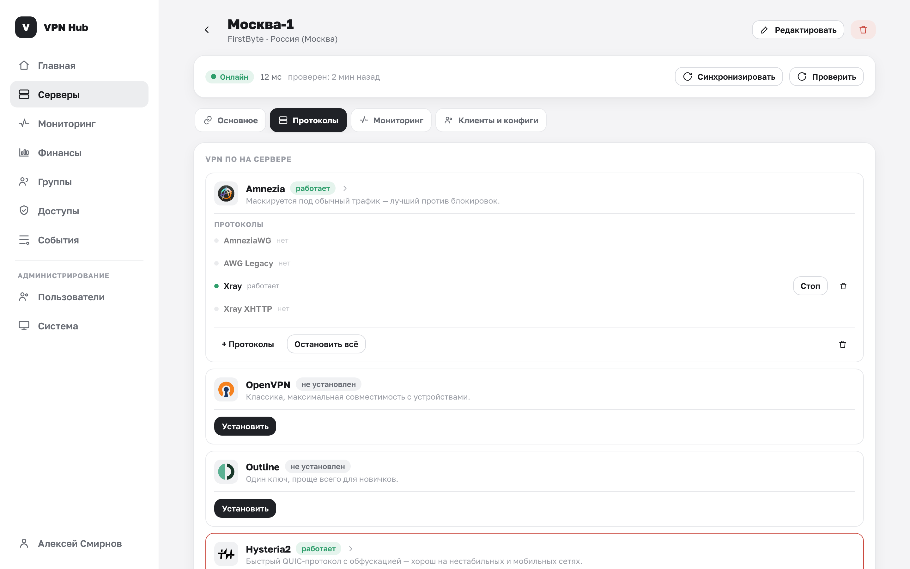

# Установка VPN на сервер

Пока на сервере не установлен VPN-софт, раздавать через него доступ нельзя. Установка выполняется
на странице сервера в блоке **«VPN ПО на сервере»**.

!!! note "Не путать с установкой самой панели"
    Здесь — установка VPN-софта на ваш **VPS** изнутри панели. Как поднять саму панель — в
    разделе [Установка](../deploy/index.md).

## Какой VPN выбрать

Доступно три варианта. Их можно ставить и совмещать на одном сервере.

| VPN | Когда выбирать | Особенности |
|---|---|---|
| **Amnezia** | Есть блокировки VPN, нужна максимальная устойчивость | Маскируется под обычный трафик. Разворачивает сразу три протокола: AmneziaWG, AmneziaWG Legacy, Xray |
| **OpenVPN** | Нужна широкая совместимость с устройствами и роутерами | Классический проверенный протокол |
| **Outline** | Нужен самый простой вариант «для бабушки» | Один короткий ключ, простое приложение |

!!! tip "Если сомневаетесь"
    Начните с **Amnezia** — он лучше всех обходит блокировки. Дополнительно можно поставить
    OpenVPN или Outline для устройств, где нужнее совместимость или простота.

## Как установить

1. В блоке «VPN ПО на сервере» напротив нужного варианта нажмите **«Установить»**.
2. Установка идёт **в фоне** и занимает пару минут (для Amnezia дольше — ставятся три контейнера).
3. Статус меняется: «устанавливается…» → «работает». Страница обновляется сама.

!!! note "Почему это не мгновенно"
    Панель по SSH скачивает и собирает Docker-образы прямо на вашем сервере. Можно спокойно уйти со
    страницы — установка продолжится, а результат появится при следующем открытии или
    [синхронизации](servers.md#sync).

### Протоколы и их статусы

У Amnezia под одним «вендором» — несколько протоколов, у каждого свой статус:

| Статус | Значит |
|---|---|
| **нет** | Протокол не установлен |
| **устанавливается…** | Идёт фоновая установка |
| **готов** | Протокол установлен и управляется панелью |
| **внешний** | Протокол найден на сервере, но поставлен не панелью (взят под наблюдение) |
| **ошибка** | Установка не удалась — текст ошибки показан рядом |

## Управление установленным VPN

Когда VPN установлен, вместо кнопки «Установить» появляются:

- **«Запустить» / «Стоп»** — включить или остановить VPN-контейнеры. Доступны, только когда сервер
  онлайн.
- **Корзина** — удалить VPN с сервера.

При удалении VPN появится предупреждение:

> ПО будет помечено как не установленное, доступы к нему снимутся.

## Подробнее о VPN (контейнеры, ключи, клиенты)

Клик по установленному VPN открывает окно **«… · подробно»**. Оно пригодится для диагностики и
ручного управления клиентами.

### Контейнеры / протоколы

Для каждого протокола показаны:

- статус, имя контейнера и порт;
- **ключи сервера** (например, публичный ключ) — можно скопировать;
- **параметры обфускации** (для AmneziaWG) — под раскрывающимся блоком;
- текст ошибки, если протокол в состоянии «ошибка».

### Пиры / клиенты {#peers}

Список всех выданных через этот сервер конфигов: кому и на какое устройство, протокол, IP-адрес
клиента, статус. Здесь конфиг можно **скопировать по ID** или **отозвать** (кнопка с корзиной) —
после отзыва пир удаляется на сервере и доступ через него пропадает.

Отзыв конфигов также доступен в блоке [Пользователи с доступом](clients.md) на самой странице
сервера — это одно и то же действие, показанное с разных сторон.

## Внешние клиенты {#external}

Если вы (или кто-то с доступом к серверу) заводили клиентов **напрямую через официальный клиент
Amnezia**, панель их обнаружит при синхронизации и покажет как **внешние** (например, «+2 внешн.»).

- Панель **их не трогает**: не отзывает и не переоформляет.
- Кнопка **«Показать внешних»** в окне «подробно» выводит их список.
- Так вы видите полную картину, даже если сервером управляли в обход панели.

!!! warning "Переустановка Outline"
    При удалении и повторной установке Outline его состояние (ключи) очищается на сервере, поэтому
    старые ключи перестанут работать — их нужно будет выдать заново.
